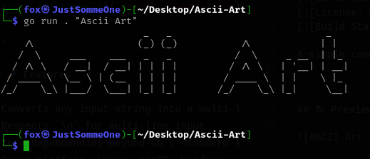

# ASCII Art Generator

A simple command-line tool that converts your text into stylish ASCII art using a predefined font.

---

## 📸 Preview



---

## 🚀 Features

- Converts any input string into a multi-line ASCII art banner  
- Respects `\n` for multi-line input  
- Zero dependencies beyond Go’s standard library  
- Cross-platform: Linux, macOS, Windows

---

## 💾 Installation

1. Make sure [Go](https://golang.org/dl/) (≥1.20) is installed  
2. Clone and build:

   ```bash
   git clone https://github.com/AhmedTalbii/Ascii-Art.git
   cd Ascii-Art
   go build -o ascii-art-generator main.go
   ```

---

## 🎯 Usage

```bash
# Single-line text
./ascii-art-generator "Hello, World!"

# Multi-line support
./ascii-art-generator "Line one\nLine two\nLine three"
```

**Example Output:**

```bash
$ ./ascii-art-generator "Golang"
  _____           _                          
 / ____|         | |                         
| |  __    ___   | |   __ _   _ __     __ _  
| | |_ |  / _ \  | |  / _` | | '_ \   / _` | 
| |__| | | (_) | | | | (_| | | | | | | (_| | 
 \_____|  \___/  |_|  \__,_| |_| |_|  \__, | 
                                       __/ | 
                                      |___/  
```

---

## ⚙️ Configuration & Custom Fonts

> _Coming soon:_ Ascii Art web is a web site that generates Ascii Art

## You can do what ever you want with the code Enjoy 😃
